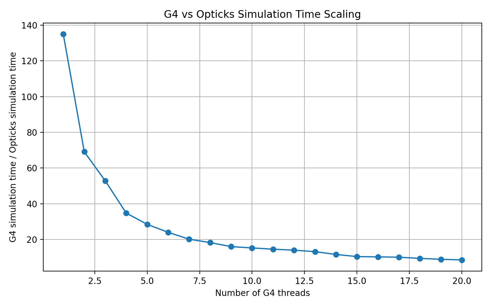

### How to run the performance analysis in this branch

The following command install the code from Git, compiles it and sets the revelant env variables for Opticks:

```bash install.sh``` 

The following command performs the performance analysis:

```python run_performance.py``` 

The latter command runs the Geant4 CPU simulation 40 times all together. It runs with number of treads from 1 to 20. For each thread number it runs with and without tracking the Cerenkov light. The difference of these runtimes is the G4 simulation time required to simulate solely the optical photons.

Since Opticks simulation is run each time the runtimes are printed out to a file.

### Outputs

```Opticks.txt``` contains the Opticks simulation time for each number of threads (constant except first one where geometry is pushed to GPU and seeds are init).  ```timings.txt``` contains the G4 OPTICAL photon simulation time for each number of threads.

### Plotting the results:

```python plot_performance.py```

creates the plot for speedup of Opticks vs G4 for each seed setting.

An example plot with not full GPU utilization:



### Notes

Currently 50k electrons are simulated. This does not fully utilize the GPU so extra speedup is expected.
